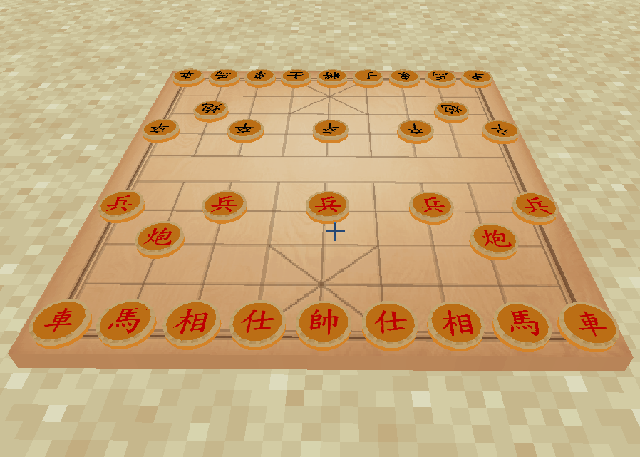
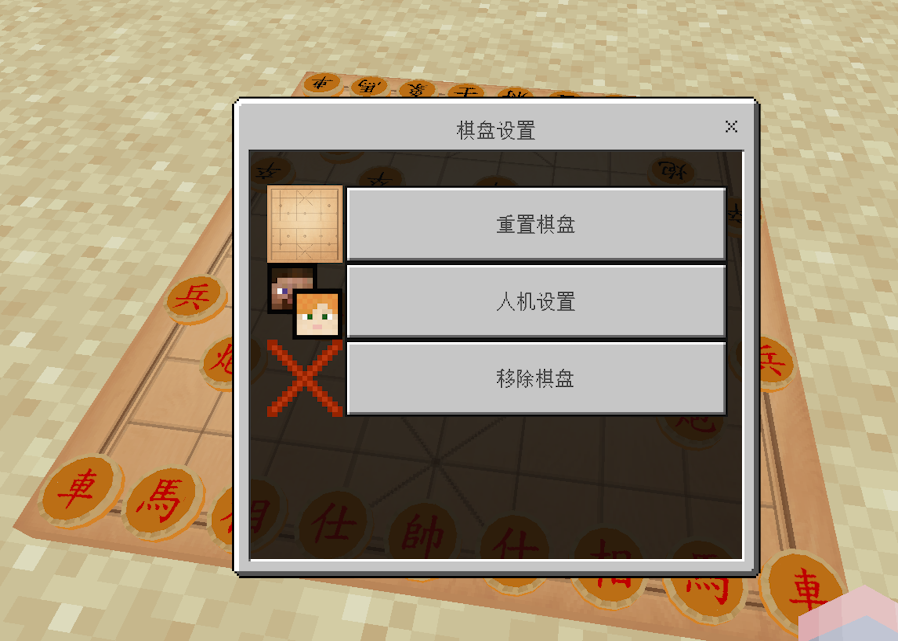

# ChessGame - Nukkit象棋插件

快来一起下象棋！本插件为Nukkit服务器添加了中国象棋功能，支持AI对战与玩家对战。

## 功能特点

- 🎮 双人对战模式
- ⚙️ 智能AI对战（简单/中等/困难三种难度）
- 👁️ 基于视角的直观操作：
  - 长按或右键棋子拿起
  - 再次长按或右键放置
- 🎚️ 游戏控制面板：
  - 执行 `/cg` 在脚下生成棋盘
  - 长按或右键棋盘打开控制界面
- ⚙️ 可配置AI难度
- 
## 安装方法

1. 将插件放入Nukkit服务器的`plugins`文件夹
2. 重启服务器
3. 在游戏中使用`/cg`命令生成棋盘

## 操作指南

1. 生成棋盘：在游戏中输入 `/cg`
2. 开始游戏：
   - 右键棋盘选择"玩家对战"或"AI对战"
   - 选择AI难度（简单/中等/困难）
3. 操作棋子：
   - 长按或右键点击棋子拿起
   - 移动准星到目标位置
   - 再次长按或右键放置棋子
   - 

## 游戏截图

 

